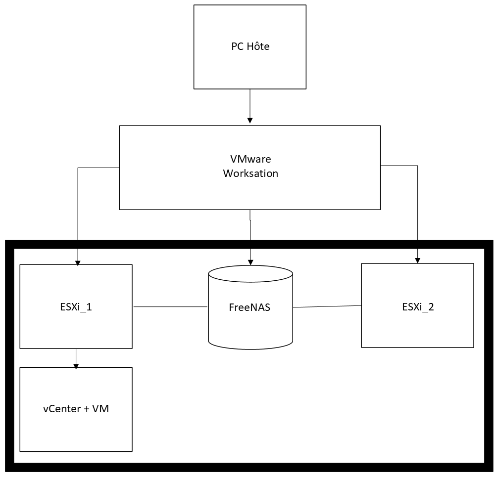

## ⚙️ Configuration matérielle & architecture du lab

La configuration matérielle dépend bien sûr des ressources dont vous disposez.  
Dans mon cas, les limitations de stockage m'ont poussé à opter pour une approche en thin provisioning. Cela signifie que les disques virtuels ne prennent pas tout leur espace déclaré dès le départ, mais s’agrandissent au fur et à mesure que les données s’y ajoutent.

📝 Avantage : pratique pour les outils qui demandent beaucoup d’espace à l’installation mais en utilisent peu au final. 

⚠️ Inconvénient : attention à ne pas oublier qu’on est en thin — le disque peut grandir jusqu’à saturer l’espace physique sans crier gare.   

## 🖥️ Détails des machines

🔹 ESXi_1  
RAM : 10 GB  
vCPU : 2  
Disques :    
Disk 1 : 60 GB → Système ESXi  
Disk 2 : 80 GB → VM internes  
Disk 3 : 600 GB → Stockage partagé (tests HA, VMotion, DRS)  

🔹 ESXi_2  
RAM : 6 GB  
vCPU : 2  
Disques :  
Disk 1 : 60 GB → Système ESXi  
Disk 2 : 100 GB → VM internes / backups  

🔹 vCenter  
RAM : 8 GB 
vCPU : 2  
Disque : 50 GB (thin)  

💡 Remarque : vCenter est assez gourmand en RAM, surtout en environnement nested. Il faut donc prévoir du temps pour le boot et la configuration initiale.  

🔹 FreeNAS  
RAM : 1 GB
vCPU : 1  
Disques :  
Disk 1 : 20 GB → OS FreeNAS  
Disk 2 : 400 GB → Stockage NFS 
Disk 3 : 200 GB → Stockage iSCSI (pour les tests de datastores centralisés)  

## 🧱 Architecture globale

                
