# 🖥️ Installation de l’ESXi_1
 

## Introduction

Dans ce lab, j’utilise la **virtualisation imbriquée** (*nested virtualization*) en installant **ESXi_1** sur **VMware Workstation**.

> ℹ️ Je ne détaille pas ici le processus complet d'installation de l'iso ESXi.  

>🔍 Pour connaître le détail de la configuration que j'ai mis en place pour mon ESXi c'est par ici. ➡️ `architecture.md`

 

# ⚙️ Configuration à effectuer ESXI_1

Voici les principaux paramètres à configurer :

- **Carte réseau principale** : `NAT`  
- **Adresse IP statique** : `192.168.1.170`
- **Serveur DNS principal** : `192.168.1.1`
- **Serveur DNS secondaire (alternate)** : `1.1.1.1`
- **Nom d’hôte (hostname)** : `ESXi`
- **Clavier** : `French`
- **Nom de domaine complet (FQDN)** : `esxi-1.labo.local`

## 🔎 Vérification réseau

Une fois l’installation terminée, je lance un test réseau via l’interface ESXi.  
✅ Tous les tests passent **sauf la résolution DNS**, ce qui est **normal à ce stade**.

Voici une capture illustrant la configuration réseau de l’ESXi :

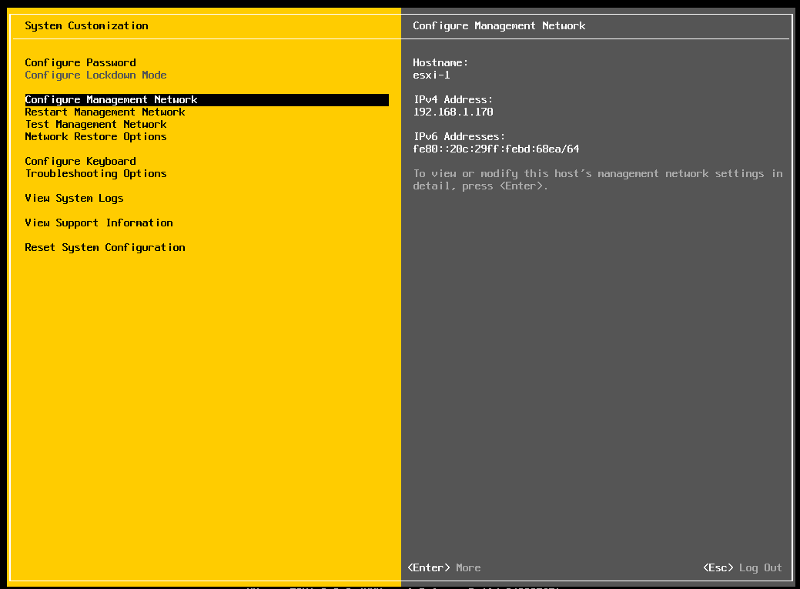

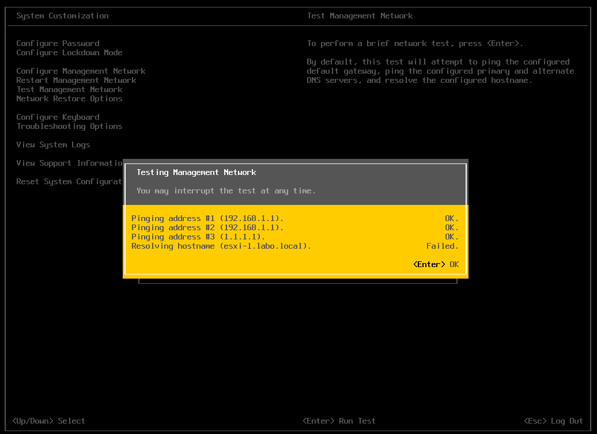

Ensuite, je vais me connecte à mon ESXi avec on IP static précédemment configuré. 
Je monte le disque en VMFS 6 afin d’avoir une data store local.

 

# 🌐 Configuration du DNS avec Technitium DNS

## Pourquoi un service DNS ?

Pour fonctionner correctement, **vCenter** a besoin d’un **service DNS** fonctionnel sur le réseau.  
Il est essentiel que les équipements puissent **communiquer entre eux** à l’aide :
- d’une **entrée A** (résolution de nom → adresse IP)
- d’une **entrée PTR** (résolution inverse : IP → nom de domaine)

> 🧠 Cette configuration permet aussi de simuler un environnement professionnel réaliste.

## 🛠️ Choix de Technitium DNS

Pour ce lab, j’ai choisi **Technitium DNS** car :
- il est **léger**,
- **simple d’utilisation**,
- et très **adapté** aux environnements de test comme celui-ci.

## 📁 Création de la zone DNS

J’ai créé une **zone principale** nommée `labo.local`.

Dans cette zone, j’ai ajouté les entrées suivantes :
- `esxi-1.labo.local`
- `esxi-2.labo.local`
- `vcenter.labo.local`

Chaque entrée dispose de :
- son **enregistrement A** (nom → IP)
- son **enregistrement PTR** (IP → nom)

## 🖼️ Vérification avec captures d’écran

Voici une capture d’écran montrant que les entrées **PTR** sont bien configurées :

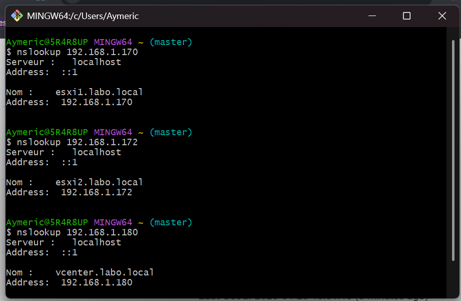

>## 📌 Remarque
>Cette étape est **cruciale** pour que le vCenter puisse s’installer correctement, surtout si vous prévoyez d’utiliser des certificats, ou que vous souhaitez un fonctionnement optimal de la résolution DNS dans votre lab.

# 🧩 Déploiement du vCenter

## 1️⃣ Lancement de l’installation

À ce stade de mon lab, je peux commencer la première étape de la configuration du **vCenter**.

Étant donné que je suis sur un **home lab** avec des ressources matérielles limitées, j’ai choisi un **déploiement de taille "Très petite"** (*Tiny Deployment*).

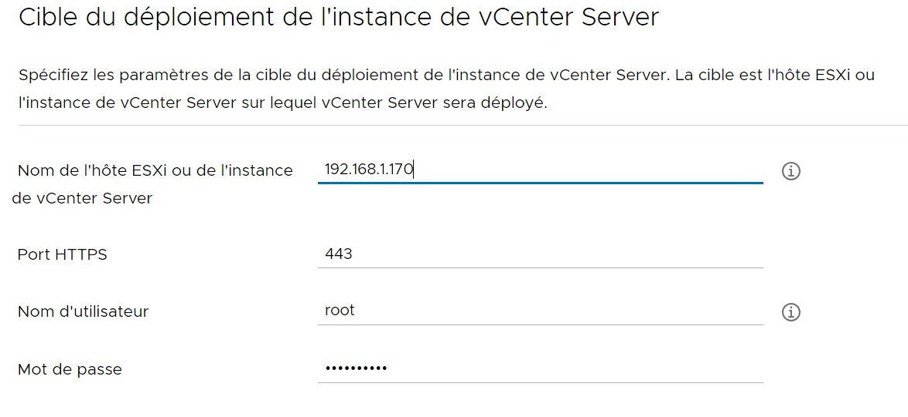  
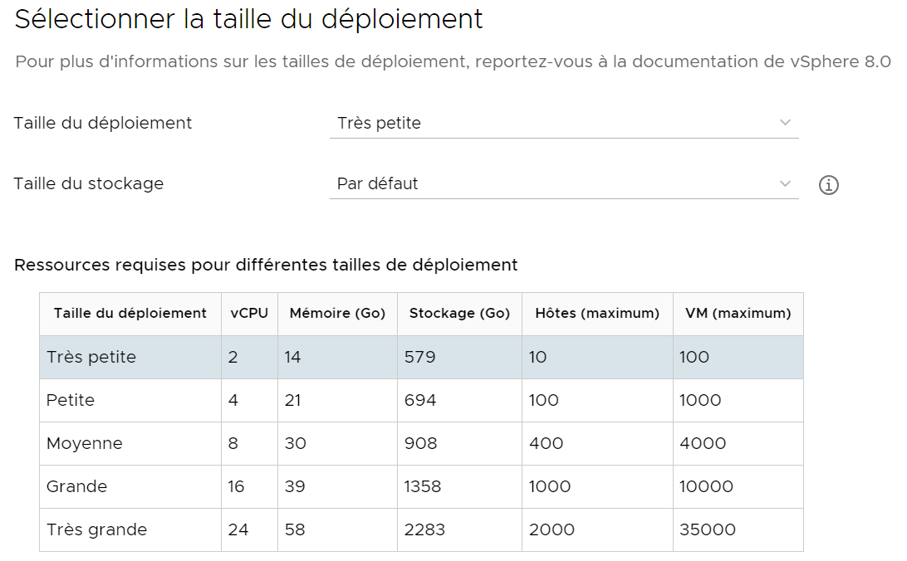
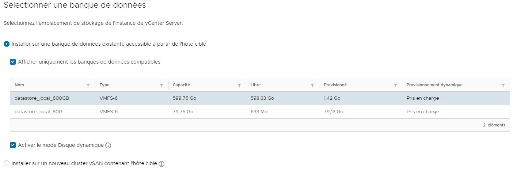

## 2️⃣ Configuration réseau du vCenter

Voici les paramètres réseau que j’ai configurés :

- **Adresse IP statique** : `192.168.1.200`
- **Passerelle** : `192.168.1.254`
- **DNS** : `192.168.1.12`  
  > ℹ️ Il s’agit de l’adresse IP de **mon hôte**, qui fait désormais office de **serveur DNS grâce à Technitium DNS**.
- **Nom d’hôte (FQDN)** : `vcenter.labo.local`

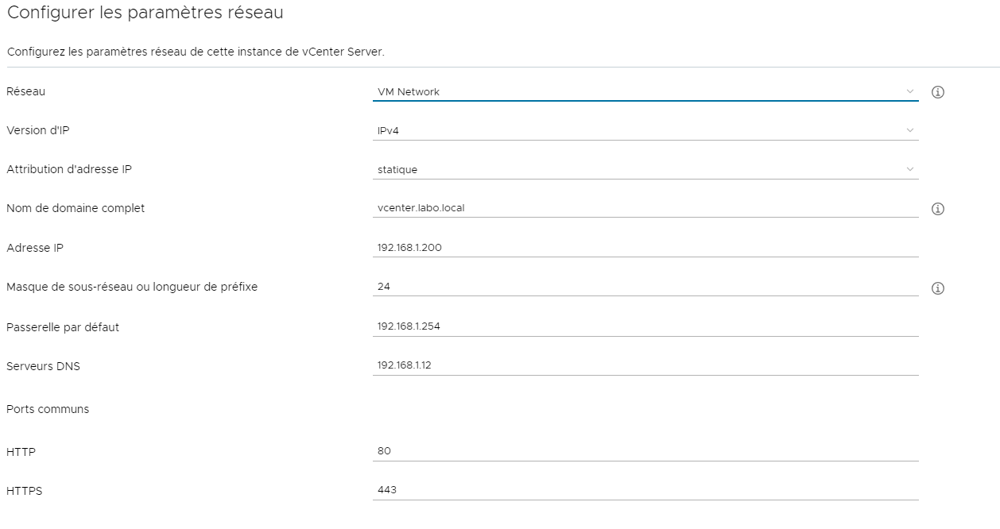

## 3️⃣ Fin de la première étape

L’étape 1 du déploiement est terminée.  
Voici un **récapitulatif de la configuration** :

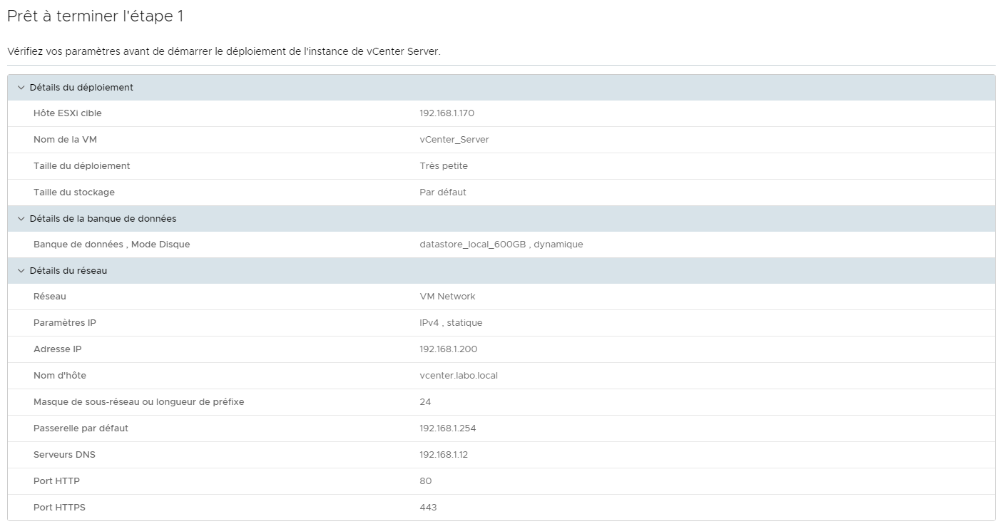
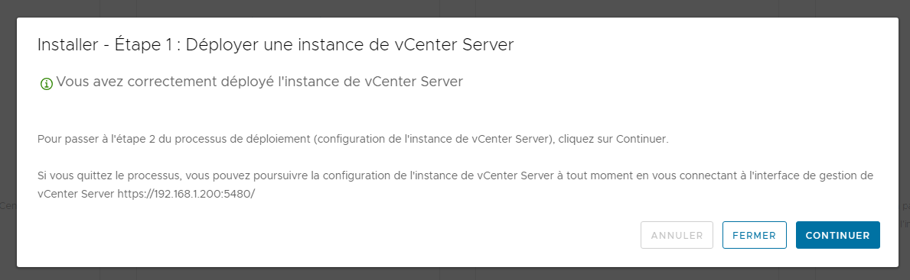
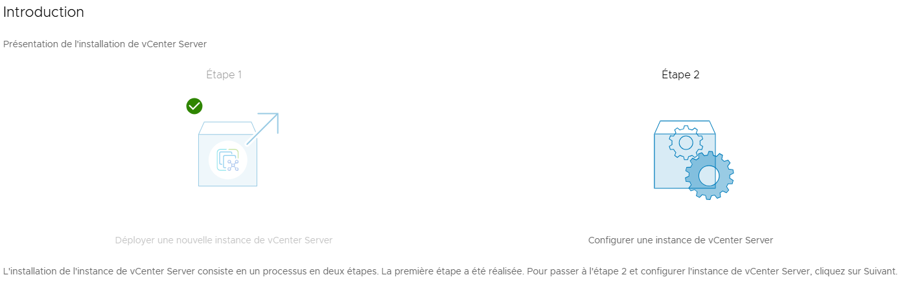

## 4️⃣ Connexion à l'interface de gestion

Une fois la configuration terminée, je peux me connecter à **l’interface de gestion du vCenter** via l’URL fournie, par exemple : http://192.168.1.200:5480

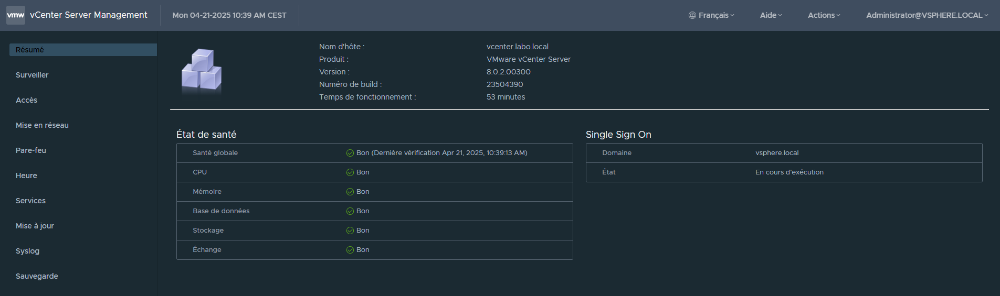

## 5️⃣ Configuration de l’instance vCenter Server

Je poursuis avec la **seconde phase** :  
> 🔧 *Configurer une instance de vCenter Server*

## 6️⃣ Configuration du domaine SSO (Single Sign-On)

Je configure ensuite le domaine **SSO (Single Sign-On)**, indispensable pour :
- s’authentifier sur le **vCenter**,
- mais aussi sur d’autres produits VMware intégrés au lab.

Nom du domaine SSO : `vsphere.local`  
Nom d’utilisateur : `administrator@vsphere.local`

## ✅ Connexion finale

Une fois la **deuxième étape** terminée, je peux me connecter **directement** via l’URL du vCenter.

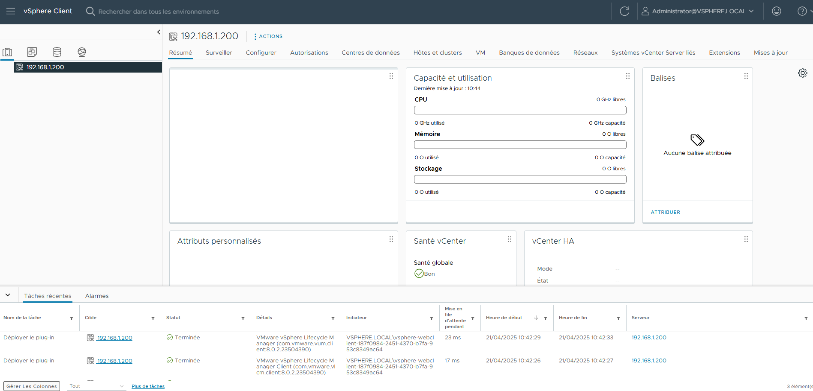

## 📦 À retenir

- Choisir une **taille adaptée** à vos ressources
- Ne pas oublier de **configurer correctement le DNS** pour éviter les erreurs à l’étape 2
- Le **domaine SSO** est clé pour l'authentification centralisée

  

# 🖥️ Installation de ESXi_2

## 🎯 Objectif

À cette étape, je vais installer un **deuxième hôte ESXi** afin de commencer à structurer mon infrastructure autour d’un **Datacenter virtuel** dans vCenter.

> ℹ️ Je ne détaille pas ici le processus complet d'installation de l'iso ESXi.

>🔍 Pour connaître le détail de la configuration que j'ai mis en place pour mon ESXi c'est par ici. > `architecture.md`

## 🏗️ Création du Datacenter

Depuis l’interface de vCenter, je commence par **créer un Datacenter**, qui servira à regrouper mes hôtes ESXi.

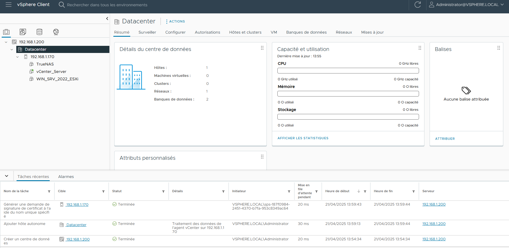

## ➕ Ajout de l’hôte ESXi_2

Pour ajouter mon second ESXi à vCenter, je suis les étapes suivantes :

1. Cliquer sur `Ajouter un hôte`
2. Saisir l’**adresse IP** ou le **FQDN** de l’ESXi (`192.168.1.172` par exemple)
3. Renseigner les identifiants de connexion :
   - **Nom d’utilisateur** : `root`
   - **Mot de passe** : `********`
4. Confirmer les informations
5. Attribuer une **licence** (j’utilise ici la version d’**évaluation**)

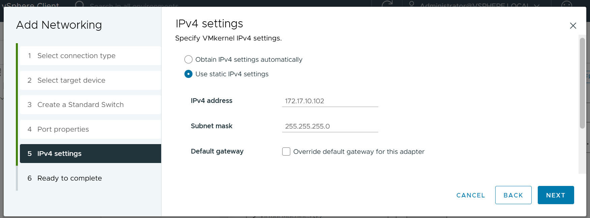

## 📦 Résultat

Une fois ajouté, les **machines virtuelles déjà présentes sur ESXi_2** apparaissent automatiquement dans l’inventaire vCenter.

> 🔄 Cela facilite la gestion centralisée de toutes les VM depuis une seule interface.

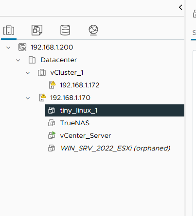

## ✅ Prochaine étape

Maintenant que les deux hôtes ESXi sont intégrés à vCenter, je vais pouvoir configurer :
- Un **cluster**  
Grâce au cluster je vais regrouper mes ESXI et également pouvoir utiliser des options comme H.A vMotion, DRS, FT.

- Les **réseaux distribués**  
Amélirore la gestion et la mobilité des VM.

- Les **stockages partagés**    
(pour simuler un environnement de production encore plus réaliste)

# 💾 Installation & Configuration de FreeNAS

## 🎯 Objectif

Pour simuler un environnement professionnel et tirer parti des fonctionnalités avancées de **vCenter**, j’ai besoin d’un **stockage partagé** accessible par mes hôtes ESXi.  
Dans ce lab, j’utilise **FreeNAS** (ancienne version de TrueNAS) pour émuler une **baie SAN (Storage Area Network)**.

> 💡 J’ai opté pour FreeNAS pour sa légèreté, car mes ressources matérielles sont limitées.

Une fois la VM démarrée, j’attribue une **adresse IP fixe** pour l’accès principal : 192.168.180

## 🌐 Configuration Réseau

Je crée deux interfaces réseau distinctes sur FreeNAS pour séparer les protocoles de partage :

- **NFS** → `172.16.10.10/24`  
- **iSCSI** → `172.17.10.10/24`

## 🗂️ Création des volumes & partages

1. **Création du volume** :
   - Nom : `NTFS_Partagé`
   - Disque utilisé : `da1` (400 Go)

2. **Partage NFS** :
   - Mappé sur le volume `NTFS_Partagé`
   - Accès restreint uniquement aux hôtes connectés au sous-réseau `172.16.10.0/24` (via une règle de sécurité)

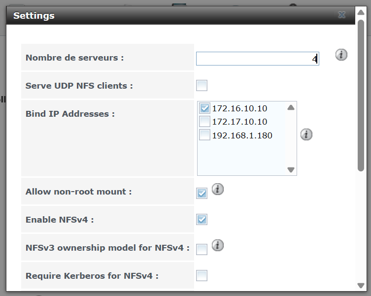

## ✅ Prochaine étape

Ce volume NFS sera ensuite **monté dans vCenter** pour être utilisé comme **datastore partagé** par mes hôtes ESXi.

Cela me permettra de :
- Migrer des VM entre hôtes (vMotion)
- Déployer des clusters HA/DRS
- Simuler un environnement professionnel complet  
 

# 🌐 Création & Configuration des Réseaux de Stockage

## 🎯 Objectif

L’étape suivante consiste à **créer deux réseaux de stockage** dans VMware Workstation, puis à les connecter à **FreeNAS** et aux deux **hôtes ESXi**.  
Cela permettra à tous les équipements de communiquer correctement, notamment pour le partage NFS et l’accès iSCSI.

## 🛠️ Étapes de configuration

### 1. Création des réseaux sur VMware Workstation

Dans VMware Workstation :

- Créer deux réseaux internes personnalisés (via l’éditeur de réseau virtuel) :
  - `VMnet2` pour le **réseau NFS** (ex. : `172.16.10.0/24`)
  - `VMnet3` pour le **réseau iSCSI** (ex. : `172.17.10.0/24`)

> 📝 Ces réseaux ne doivent pas avoir de passerelle par défaut ni de serveur DHCP : ils sont isolés pour le stockage.

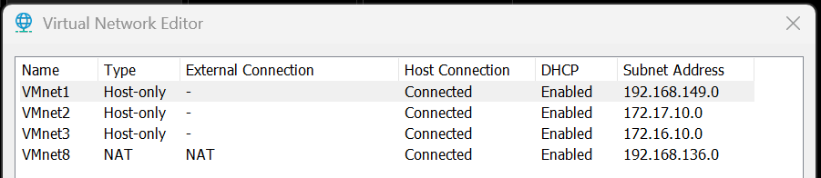

### 2. Attribution des interfaces réseau

Dans la configuration de la VM **FreeNAS**, associer :
- `VMnet2` à l’interface NFS (`172.16.10.10`)
- `VMnet3` à l’interface iSCSI (`172.17.10.10`)

Sur les ESXi, on va créer un vSwitch dédié par réseau, puis y associer une interface **vmkernel**.

### 3. Monter le stockage NFS

Dans le vCenter, il va falloir monter notre espace de stockage NFS. Il sera crée sous forme d'un `Datastrore`.

> ⚠️ Attention : Ne pas se tromper au niveau du chemin au FreeNAS, et indiquer le bon réseau. 

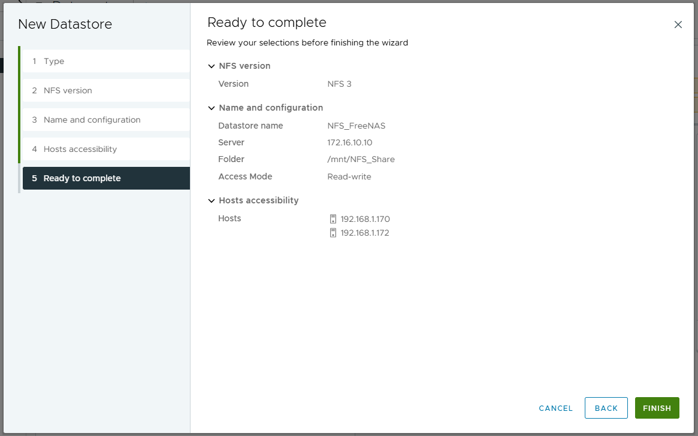

## 🔌 Paramétrage sur ESXi_1

1. Accéder à **Réseau > Commutateurs virtuels**
2. **Ajouter une mise en réseau**
   - Type : `VMkernel`
   - Nouveau vSwitch : `vSwitch-NFS`
   - Carte réseau : `vmnic1` (connectée à `VMnet2`)
   - IPv4 statique : `172.16.10.11`
   - Nom du groupe de ports : `NFS-Net`

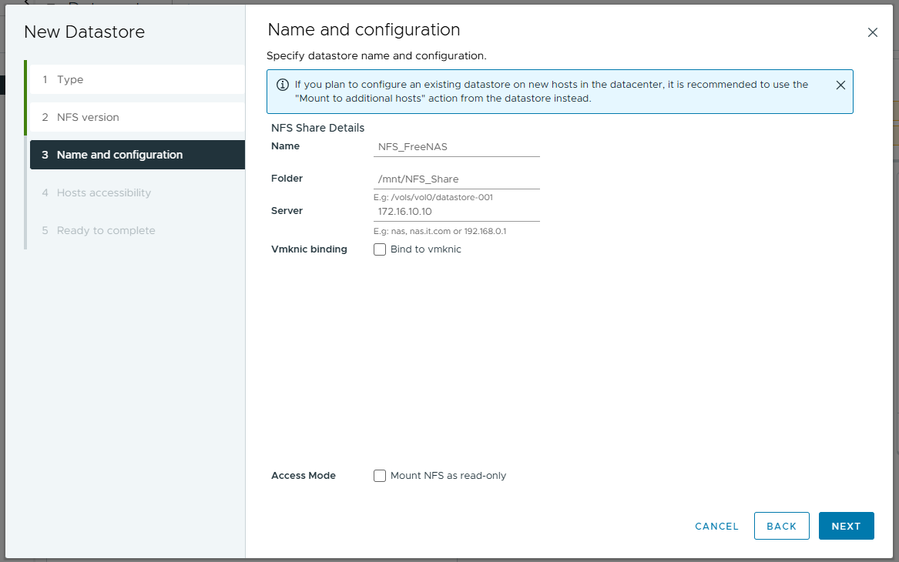

## 🔁 Répéter sur ESXi_2

Même procédure, en adaptant :

- IP statique : `172.16.10.12`
- **Nom du port group** : **identique** à celui d’ESXi_1 (`NFS-Net`) pour assurer la compatibilité

> ⚠️ Attention : les noms des port groups doivent strictement être identiques pour éviter des soucis lors du montage NFS dans vCenter.

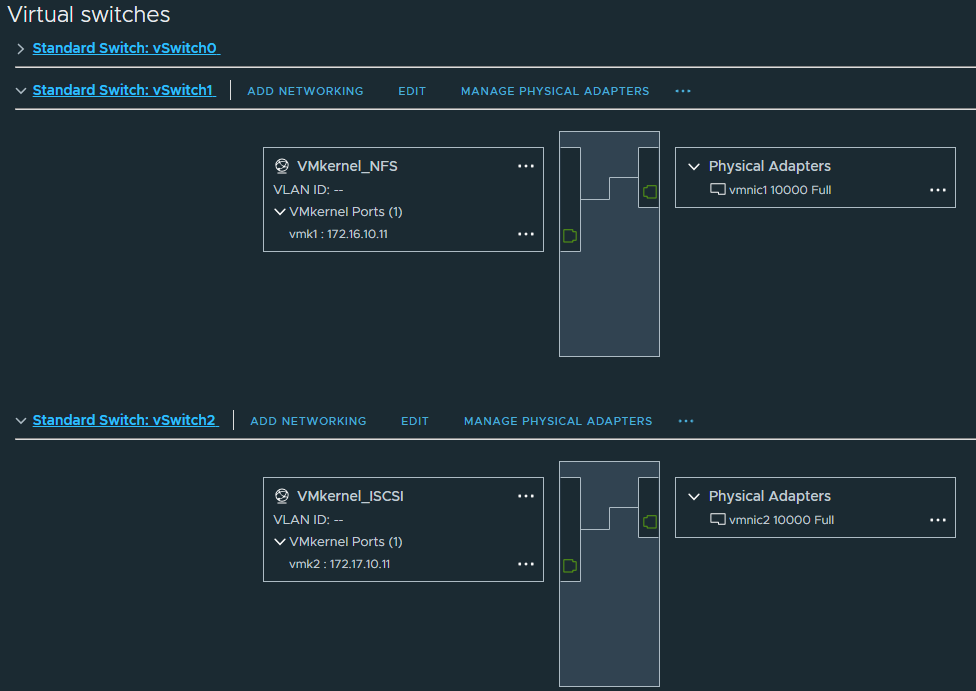

## ✅ Résultat attendu

À l’issue de cette configuration :

- Le **SAN (FreeNAS)** pourra dialoguer avec les deux **ESXi** via le réseau NFS
- La connectivité réseau dédiée au stockage est **isolée du réseau de gestion**
- Le montage du **datastore NFS** sera possible dans vCenter

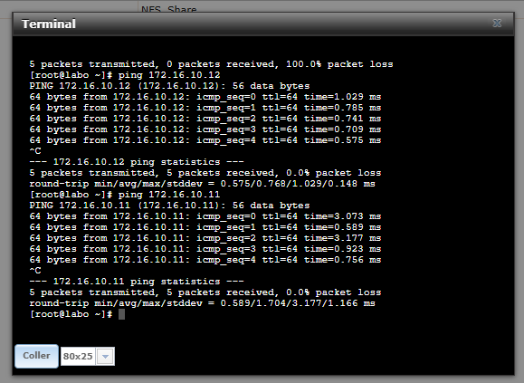
 
 

# 💾 Montage d’un Datastore iSCSI (LUN)

## 🎯 Objectif

Après avoir configuré le réseau de stockage iSCSI, je vais maintenant **monter un datastore iSCSI** sur mes hôtes ESXi à l’aide de **FreeNAS**.  
L’iSCSI est plus complexe que NFS, mais également plus répandu dans les environnements professionnels.

## 🛠️ Configuration iSCSI sur FreeNAS

### 📌 Étapes dans l’interface FreeNAS

1. **Bloc > Portails**
   - Ajouter un nouveau portail
   - Interface : `172.17.10.10`
   - Nom : `Portail iSCSI`

2. **Initiateurs**
   - Ajouter un initiateur
   - Initiateurs : `ALL`
   - Réseau autorisé : `172.17.10.0/24` (Plus sécurisé)

3. **Cibles**
   - Ajouter une cible nommée `Target_FreeNAS`
   - Associer au portail et à l’initiateur créés

4. **Extensions**
   - Ajouter une extension iSCSI à partir du disque `da2` (ex. : `Disque_3`)

5. **Cibles > Extensions**
   - Associer la cible `Target_FreeNAS` au disque `Disque_3` avec le **LUN ID = 1**

6. **Services**
   - Activer le service **iSCSI**

## ⚙️ Configuration réseau iSCSI sur les hôtes ESXi

### 🔧 Sur ESXi_1

1. Accéder à **Réseau > Commutateurs virtuels**
2. Ajouter une mise en réseau :
   - Type : `VMkernel`
   - Nouveau vSwitch : `vSwitch-iSCSI`
   - Carte réseau : `vmnic2`
   - IPv4 statique : `172.17.10.11`
   - Nom du groupe de ports : `iSCSI-Net`

### 🔁 Répéter la même configuration sur ESXi_2

- IP statique : `172.17.10.12`
- Utiliser le même nom de groupe de ports (`iSCSI-Net`)

## 🔌 Connexion entre FreeNAS et les ESXi

Une fois le réseau fonctionnel, je vais lier l’adaptateur iSCSI logiciel aux groupes de ports vmkernel.

### 📍 Sur ESXi_1

1. **Configurer > Adaptateurs de stockage**
2. Sélectionner l’adaptateur `vmhba65` (iSCSI logiciel)
3. **Liaison de port réseau > Ajouter**
   - Sélectionner le port vmkernel : `iSCSI-Net`

4. **Découverte dynamique > Ajouter serveur de cible**
   - IP cible : `172.17.10.10`

### 🔁 Répéter sur ESXi_2 avec les mêmes paramètres

## 🏁 Montage du Datastore iSCSI

1. Dans **vCenter > Datacenter**, clic droit :
   - `Stockage > Nouvelle banque de données`
2. Choisir :
   - Type : `VMFS`
   - Nom : `iSCSI_FreeNAS`
   - Sélectionner le **LUN n°1**
   - Format : `VMFS 6`

💡 Comme mes deux ESXi sont dans le **même Datacenter**, le second ESXi accède automatiquement au **datastore partagé**.

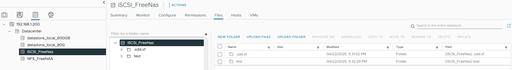

## ✅ Résultat attendu

- Un **datastore iSCSI** fonctionnel, visible sur les deux ESXi
- Une infrastructure **proche d’un environnement professionnel**
- Possibilité de créer des **VMs partagées** entre les deux hôtes

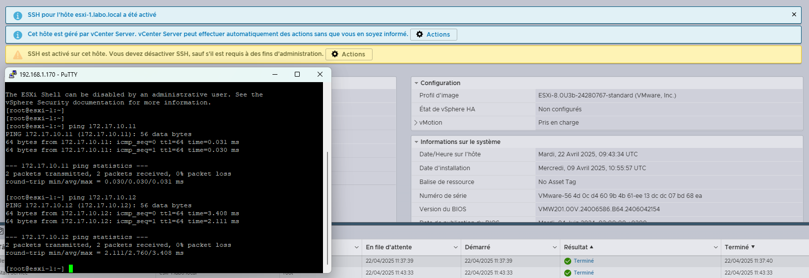

 
 

# 🚀 Profiter des fonctionnalités vSphere

Maintenant que mon infrastructure est fonctionnelle, je vais pouvoir exploiter les puissantes options offertes par la suite **vSphere**, notamment :

- **H.A. (High Availability)**
- **vMotion**
- **DRS (Distributed Resource Scheduler)**

Ces outils permettent d'optimiser la disponibilité, la mobilité des machines virtuelles et la gestion des ressources dans un environnement virtualisé.

Pour plus d'informations détaillées sur ces options, je vous invite à consulter le fichier [**readme.md**](./readme.md).
