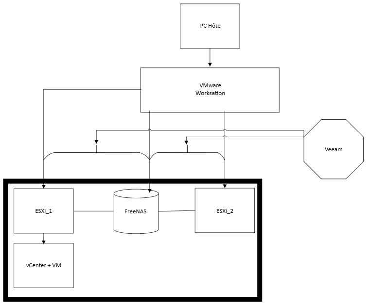

--------------------------------
# 🗺️ Plan du repository
```bash
home-lab-vsphere/  
├── README.md                # Présentation principale du lab   
├── Architecture.md          # Description de l’architecture du lab (avec schéma)    
├── Installation.md          # Installation du lab    
├── Veeam_backup.md          # Installation et test de Veeam Backup & Replication
├── Fonctionnalités          # Options de la disponible sur vCenter    
│   └── DRS.md               # Retour d'expérience sur DRS (Distributed Resource Scheduler)   
│   └── HA.md                # Retour d'expérience sur HA (High Availability)   
│   └── vMotion.md           # Retour d'expérience sur vMotion 
│   └── FT.md                # Retour d'expérience sur Fault Tolerence   
├── images/                  # Captures d’écran et schémas    
│   └── DRS_screen           # Capture écran test DNS    
│   └── FT_screen            # Capture écran test FT
│   └── HA_screen            # Capture écran test HA  
│   └── screen_freenas       # Capture écran test DNS 
│   └── veeam_screen         # Capture écran test veeam  
│   └── vmotion_screen       # Capture écran test vMotion   
└── LICENSE                  # License MIT  
```
<br>

# 🧪 Home Lab vSphere – Virtualisation Nested

<br>

## 🌐 Introduction

La virtualisation est au cœur des infrastructures modernes. Elle permet de transformer des ressources physiques en ressources logiques, plus flexibles, modulables et résilientes. Le contexte post-COVID a d’ailleurs renforcé son adoption, avec l’essor du télétravail et des infrastructures distantes.

Dans ce projet personnel, j’ai souhaité créer un **lab de virtualisation complet** en environnement **nested** (virtualisation dans une virtualisation), en utilisant **VMware Workstation** comme base, et la suite **vSphere (ESXi + vCenter)** comme outil principal de gestion. 
Pour rendre mon infractructure la plus complète possible, j'ai également souhaité mettre en place un système de sauvegarde et de réstauration. J'ai utilisé **Veeam Backup & Replication** .


## 🧱 Objectif du Lab

- Mettre en place un environnement **vSphere complet**.
- Utiliser **vCenter** pour centraliser la gestion des hôtes **ESXi**.
- Déployer des fonctionnalités clés d’un environnement pro :
  - **HA** (High Availability)
  - **vMotion**
  - **DRS** (Distributed Resource Scheduler)
  - **FT** (Fault Tolérance)

Le tout en utilisant **Veeam Backup & Replication** comme solution de sauvegarde et de restauration des données, afin de disposer d'une infrastructure la plus fidèle possible à un environnement professionnel.

Ce projet n’est **pas un tutoriel**, mais un **retour d’expérience** avec captures d’écran, notes personnelles et quelques pièges rencontrés en chemin.


## 🧰 Environnement et prérequis

- **VMware Workstation** (environnement hôte)
- **ESXi .iso**
- **vCenter .iso**
- **FreeNAS / TrueNAS**
- **VM Linux (Debian)**
- **VM Windows Serveur pour Veeam Backup & Replication**


> ⚠️ Faute de matériel physique, j’ai utilisé la virtualisation nested (ESXi dans VMware Workstation).


## 🖥️ Architecture du Lab



Résumé :
- **VMware Workstation** héberge :
  - 2 hôtes **ESXi**
  - 1 **FreeNAS**
- **ESXi_1** héberge :
  - **vCenter**
  - Plusieurs VM (dont une Linux)
- **ESXi_2** 
- **FreeNAS** fournit du **stockage iSCSI/NFS** aux hôtes ESXi
- **vCenter** centralise la gestion (mais ne se connecte pas directement au NAS)

---

## ⚙️ Configuration matérielle

| Machine   | RAM    | vCPU | Disque(s)                       |
|-----------|--------|------|---------------------------------|
| ESXi_1    | 10 GB  | 2    | 60 GB, 80 GB, 600 GB            |
| ESXi_2    | 6 GB   | 2    | 60 GB, 100 GB                   |
| vCenter   | 8      | 2    | 50 GB                           |
| FreeNAS   | 1 GB   | 1    | 20 GB, 400 GB, 200 GB           |
| Veeam     | 4 GB   | 2    | 100 GB                          |

> 📌 Les disques sont en **Thin Provisioning** pour optimiser l’espace.


## 🔍 Fonctionnalités testées

- [x] Déploiement vCenter
- [x] Ajout des hôtes ESXi au vCenter
- [x] Création de Datastores partagés via FreeNAS (iSCSI / NFS)
- [x] Activation et test de **vMotion**
- [x] Simulation d'une coupure système avec un test du **FT**
- [x] Simulation d’indisponibilité avec test du **HA**
- [x] Test du **DRS** en surchargeant une VM
- [x] Mise en place de vSwitch


## 🧠 Retours d’expérience

- 💡 La virtualisation nested fonctionne très bien, mais nécessite pas mal de ressources.
- 🧱 Le réseau virtuel entre les hôtes et FreeNAS doit être bien configuré (VMnet host-only).
- ⚠️ Attention aux disques THIN : on peut vite saturer le SSD du PC hôte.


## 🔜 Prochaines étapes

- Tester **Fault Tolerance**
- Ajouter et configurer **Veeam backup**
- Automatiser certaines tâches avec **PowerCLI**


## 🙋‍♂️ À propos

Ce projet est personnel. Il m’a permis de consolider mes compétences en **virtualisation**, **gestion d’infrastructure**, **stockage**, et **réseaux**.


