# 📦 Projet : Sauvegarde et Restauration de VM avec Veeam Backup & Replication

## 🧠 Objectif

Mettre en place une solution de sauvegarde et de restauration complète d'une machine virtuelle dans un environnement de lab local avec :
- Création d’un espace de stockage iSCSI sur FreeNAS
- Intégration dans Veeam Backup & Replication
- Sauvegarde complète d’une VM
- Restauration de la VM

Ce projet n’est **pas un tutoriel**, mais un **retour d’expérience** avec captures d’écran et notes personnelles.

## 🖥️ Infrastructure du Lab Veeam Backup & Replication

### Répartition des VMs

- **FreeNAS** : serveur de stockage iSCSI  
- **VM vCenter** : gestion de l’hyperviseur ESXi  
- **VM Windows Server (avec Veeam B&R)** : serveur de sauvegarde  
- **VM Linux** : VM à sauvegarder/restaurer  

## 🧱 Étape 1 - Création du stockage LUN iSCSI sur FreeNAS

La création du LUN iSCSI a été documentée dans un autre projet. Pour plus de détails, consultez [cette section](./Installation.md#section-cible-iscsi).

Une fois la configuration terminée sur FreeNAS, il suffit de monter l'espace disque sur l'hôte qui héberge Veeam.

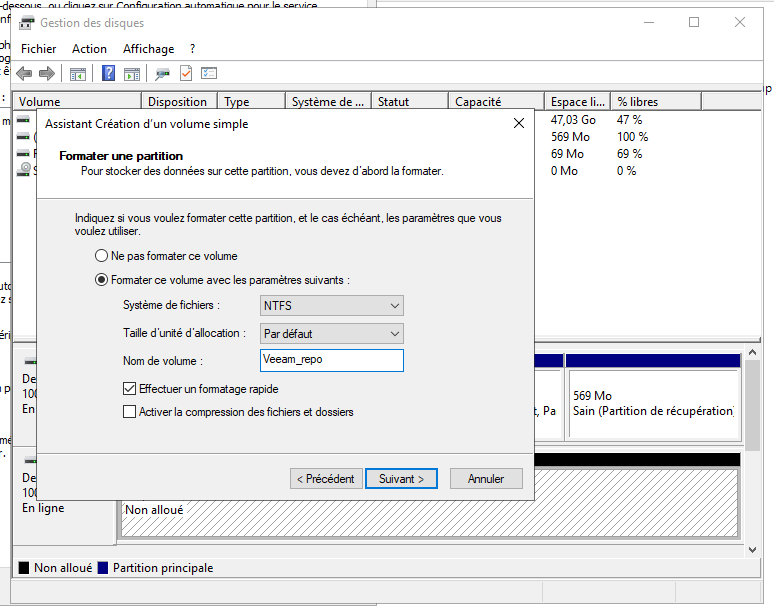  
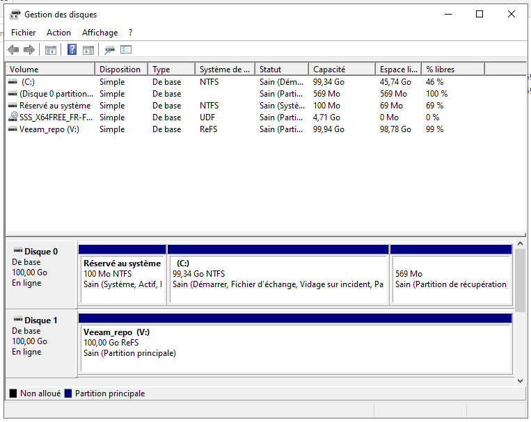

## 🖧 Étape 2 - Connexion de l’iSCSI à la VM Veeam

### Connexion depuis Windows Server (Veeam)
1. Ouvrir "Initiateur iSCSI"
2. Ajouter l’IP du target FreeNAS
3. Détection automatique du disque
4. Mise en ligne du disque
5. Initialisation + formatage du disque (NTFS)

## ⚙️ Étape 3 - Installation de Veeam Backup & Replication

Installation de Veeam Backup & Replication sur le serveur Windows Server.

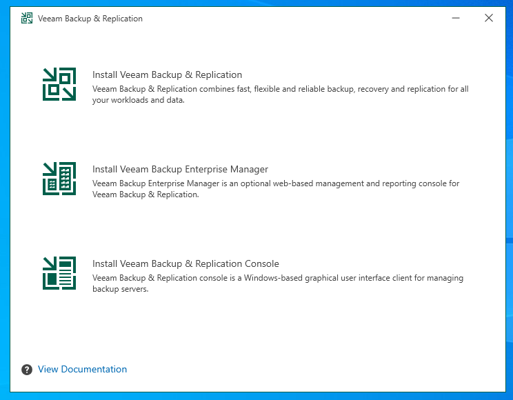

Connexion à la console via un compte administrateur disposant des droits nécessaires.

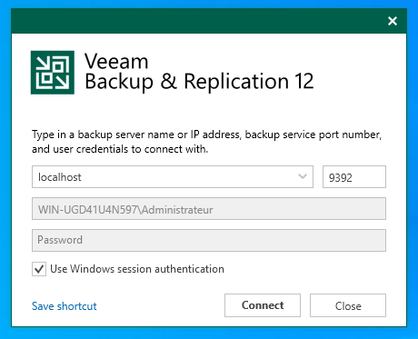

## 📂 Étape 4 - Ajout du Backup Repository

Un **backup repository** est un espace de stockage utilisé pour enregistrer les sauvegardes.  
J’ai choisi un LUN iSCSI pour simuler une baie SAN professionnelle.

1. Aller dans "Backup Infrastructure"
2. Clic droit > *Add Backup Repository*

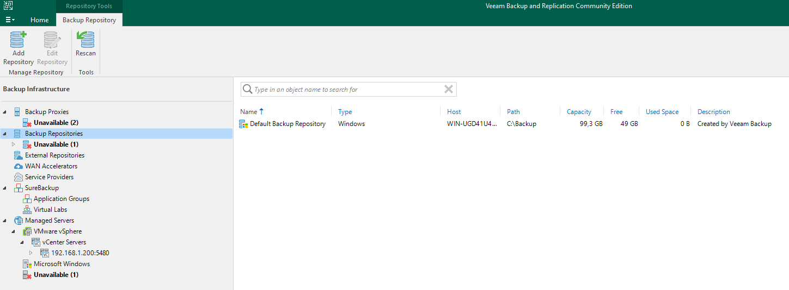

Nom et description :

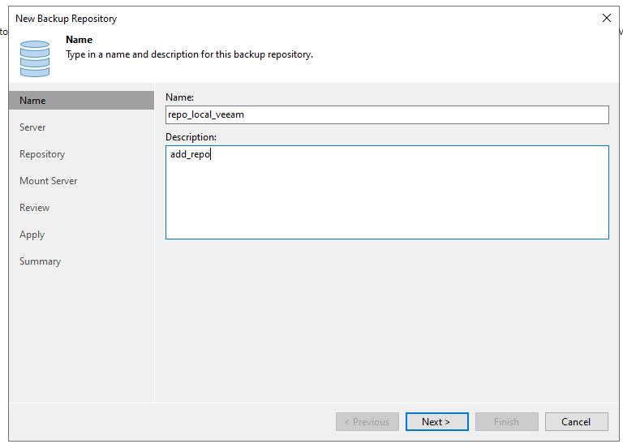

Scan des disques, puis sélection du LUN iSCSI :

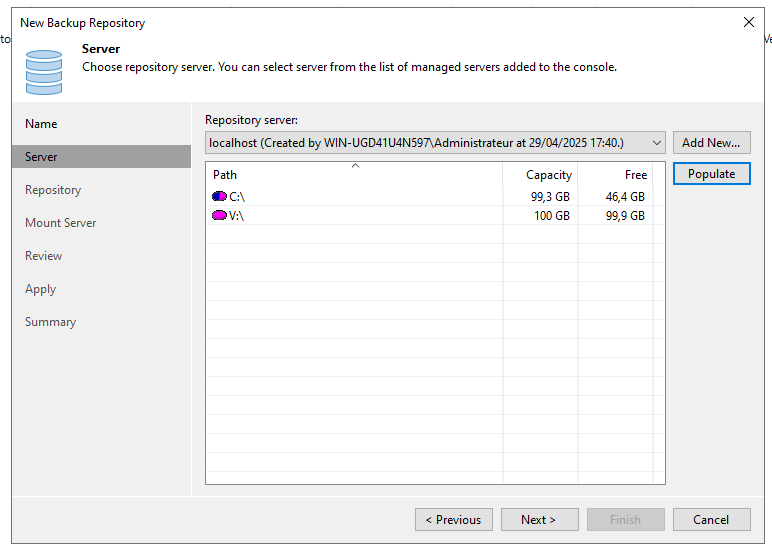

Résumé de la configuration :

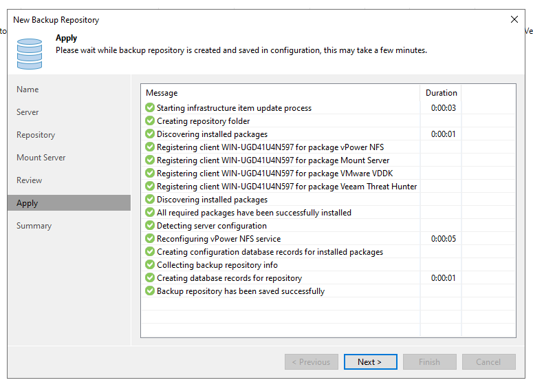

### 🔧 Création du Proxy Veeam

**Backup Proxy** : il agit comme un moteur de transfert, gère le trafic de données entre source et cible, et améliore les performances.

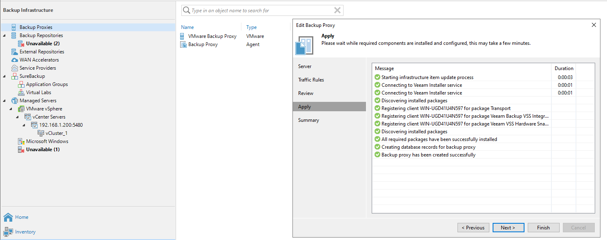

> ⚠️ Sans backup proxy, aucune sauvegarde ne peut être effectuée dans Veeam Backup & Replication.

## 🔗 Étape 5 - Connexion au vCenter dans Veeam

### Ajout du serveur vCenter

1. "Virtual Infrastructure" > *Add Server* > *VMware vSphere*  
2. Entrer l’adresse IP ou le FQDN du vCenter + identifiants

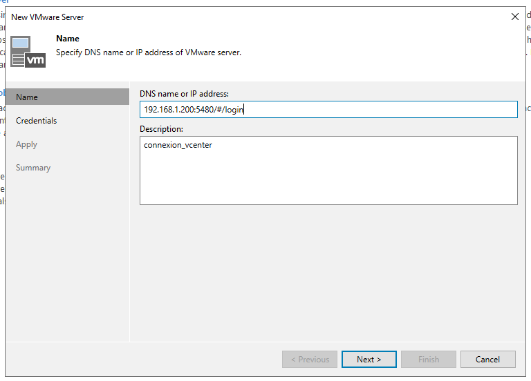

### Ajout d’un compte administrateur

Ajout d’un utilisateur ayant les privilèges administrateurs :

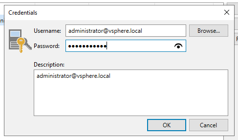

### Validation du certificat SSL

Validation du certificat du vCenter :

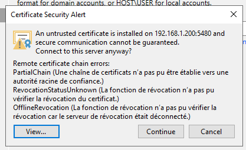

## 💾 Étape 6 - Création d’un Job de Sauvegarde

Je crée un job de sauvegarde de la VM **Linux_Veeam** sur l’hôte **ESXi_2**.

1. "Home" > *Backup Job* > *Virtual Machine*
2. Nommer le job

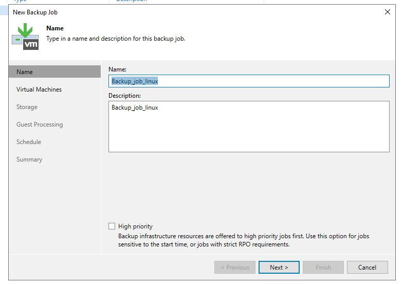

Sélection de la VM à sauvegarder :

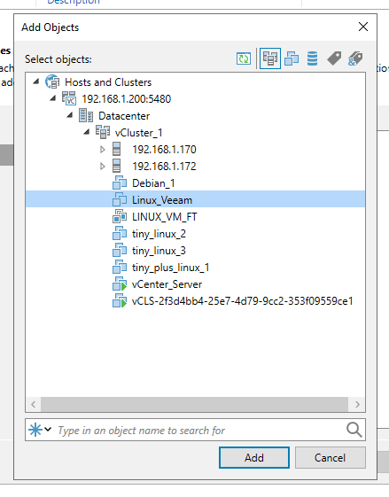

### 📌 Choix du mode de sauvegarde

J’ai opté pour une **sauvegarde incrémentale** après une sauvegarde complète.

> ✅ **Avantage** : rapide, moins de charge disque  
> ❌ **Inconvénient** : nécessite plusieurs points pour une restauration complète

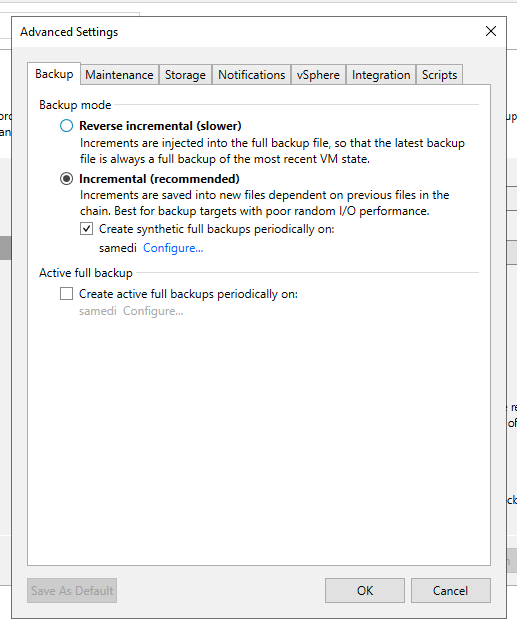

### 🗃️ Configuration du proxy, repository et politique de rétention

- Proxy : auto
- Repository : iSCSI
- Rétention : **7 jours**

  
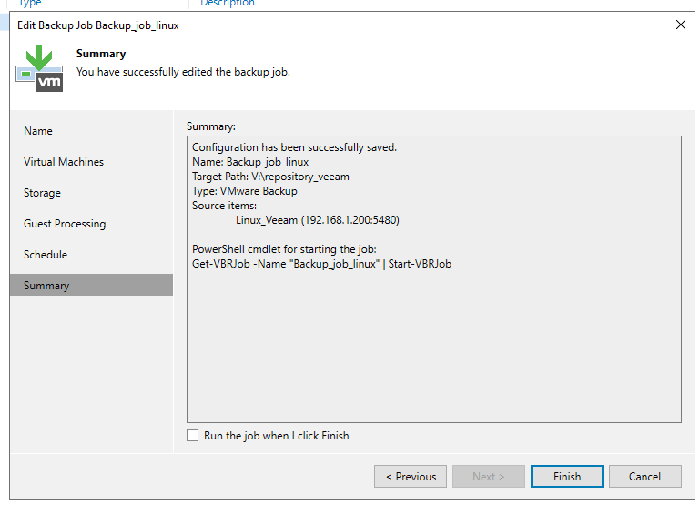

### ✅ Sauvegarde terminée avec succès

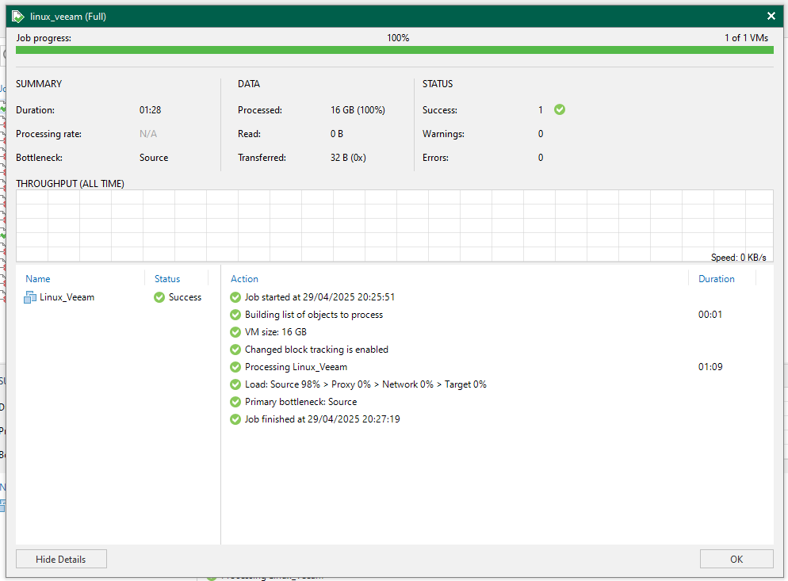  
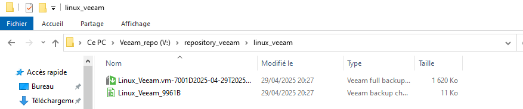

## 🔁 Étape 7 - Restauration de la VM

Maintenant que la sauvegarde est faite, je procède à la **restauration complète** grâce à *Full VM Recovery*.

1. Clic droit sur la VM > *Restore entire VM*

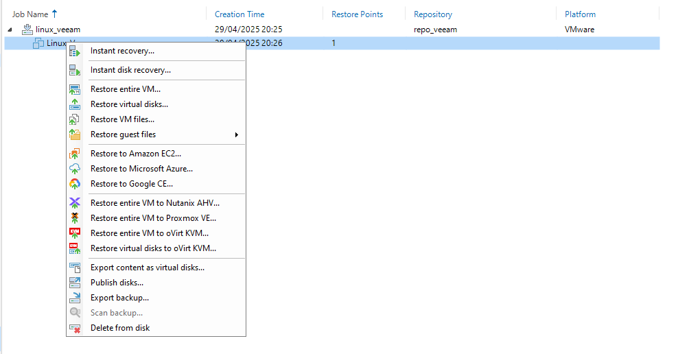  
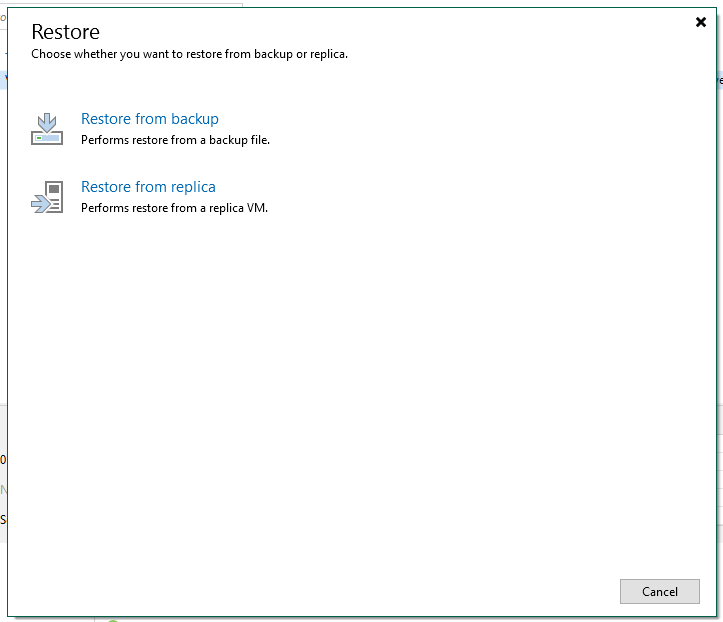  
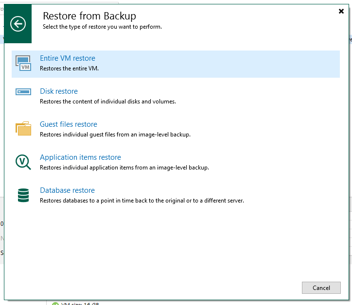

Je sélectionne la VM à restaurer :

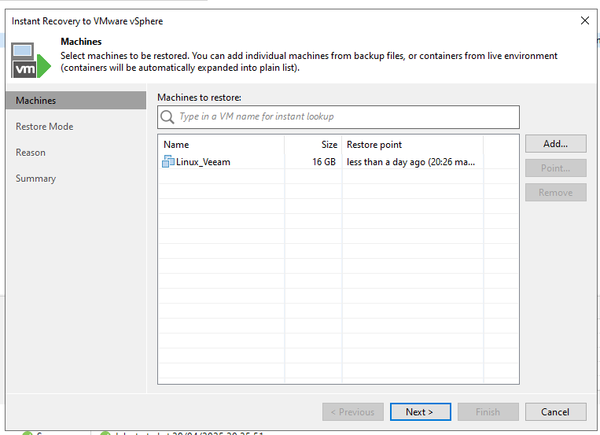

### 🟢 Résultat : succès

Restauration complète avec succès ✅

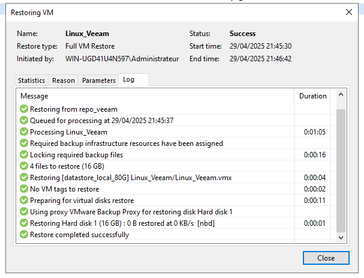

Dans l'historique, la VM apparaît bien restaurée :

*(Oui… il m’a fallu quelques essais 😅)*

## 📝 Conclusion

- ✅ Projet réalisé avec succès sur un lab local
- 💾 Sauvegarde incrémentale + rétention de 7 jours
- 🔁 Restauration complète fonctionnelle
- 🔒 Utilisation d’iSCSI pour simuler une baie SAN
- 💡 Expérience enrichissante dans la gestion de la sauvegarde VM
