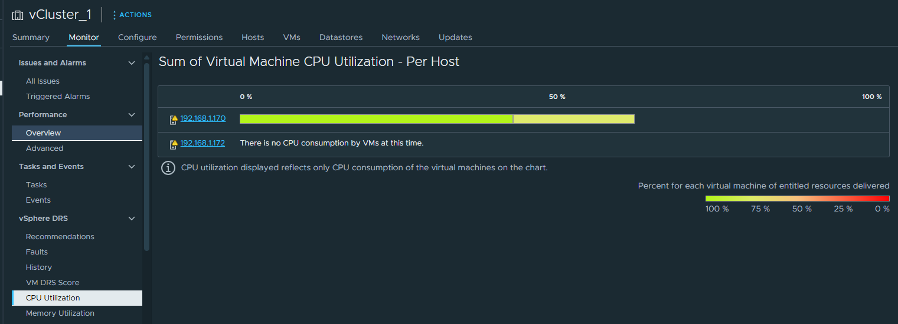
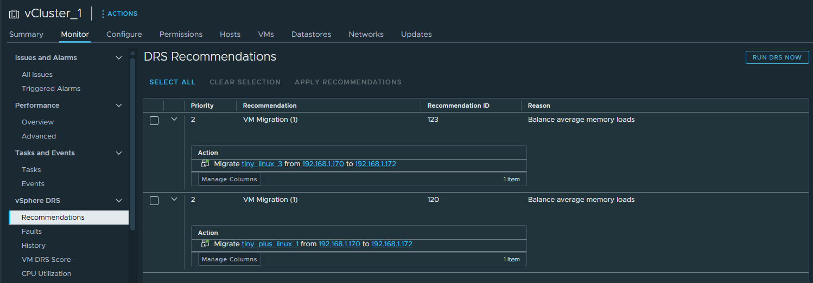

# ⚖️ DRS (Distributed Resource Scheduler)

## 🧠 Définition

**DRS**, pour **Distributed Resource Scheduler**, est une fonctionnalité de **vCenter** qui permet de **répartir automatiquement et intelligemment la charge de travail** des machines virtuelles sur les différents **hôtes ESXi** d’un **Cluster**.

🎯 Objectif : garantir une **utilisation équilibrée des ressources (CPU, RAM)** au sein du cluster pour optimiser les performances.

🔁 Pour cela, DRS utilise **vMotion** pour déplacer les VMs en **temps réel**, sans interruption.


## 🔧 Fonctionnement

1. **Analyse continue** de la charge des hôtes ESXi
2. **Détection des déséquilibres** (par ex. surcharge CPU sur un ESXi)
3. **Migration automatique** des VMs vers un hôte moins chargé grâce à **vMotion**
4. Répétition du processus à intervalles réguliers


## 🧩 Règles d'affinités DRS

DRS peut être configuré avec des **règles d’affinité et d’anti-affinité** afin de mieux contrôler **où** les VMs doivent (ou ne doivent pas) être exécutées.

### 🔗 1. Règles d’affinité

- Objectif : **forcer certaines VMs à s’exécuter sur le même hôte**
- Utilisation typique : systèmes distribués ou VMs qui doivent échanger beaucoup de données entre elles

### 🚫 2. Règles d’anti-affinité

- Objectif : **éviter que certaines VMs soient sur le même hôte**
- Utilisation typique : pour la **haute disponibilité**, éviter qu’un crash d’hôte n'affecte plusieurs VMs critiques

### 🖥️ 3. Règles "VM to Host"

- Objectif : **lier des VMs spécifiques à certains hôtes**
- Deux types :
  - **Préférentielles** : la VM peut être déplacée si nécessaire
  - **Strictes** : la VM **doit** rester sur l’hôte spécifié

🧑‍🏫 Ces règles s’appliquent via des **groupes DRS**, contenant :
- Des machines virtuelles
- Des hôtes ESXi


## ⚙️ Niveau d’automatisation DRS

DRS peut être configuré selon trois **modes d’automatisation** :

| Mode | Description |
|------|-------------|
| **Manuel** | vCenter recommande des placements, **l’administrateur décide** |
| **Partiellement automatisé** | vCenter automatise les placements **au démarrage** ou lors de **migrations manuelles** |
| **Entièrement automatisé** | vCenter effectue **automatiquement** les placements et migrations via vMotion |

### 🎛️ Seuil de migration (niveau d’agressivité)

Lorsqu’il est en **mode entièrement automatisé**, on peut ajuster le **niveau d’agressivité** de DRS (niveau 1 à 5) :

| Niveau | Description |
|--------|-------------|
| **1** | Recommandations **critiques uniquement** (affinité, maintenance) |
| **2** | + Améliorations significatives de charge |
| **3** | + Améliorations bonnes (niveau **par défaut**) |
| **4** | + Améliorations **modérées** |
| **5** | Applique **toutes** les recommandations, même minimes (⚠️ migrations fréquentes) |


## 🔍 Prérequis DRS

Pour utiliser **DRS**, il faut :

- ✅ **2 hôtes ESXi minimum**
- ✅ **1 vCenter** et un **Cluster**
- ✅ **Licences compatibles** pour vCenter et ESXi
- ✅ **Adresses IP statiques** pour les hôtes
- ✅ **Configuration réseau identique** entre hôtes :
  - Même plan d’adressage
  - **Port VMkernel** avec vMotion activé
- ✅ **Stockage partagé** entre tous les hyperviseurs
- ⚠️ **Les prérequis de vMotion doivent aussi être respectés**


## ✅ Avantages du DRS

- 📊 Équilibrage automatique de la charge
- 🚀 Optimisation des performances
- 🧘 Réduction de l’intervention manuelle
- 🔄 Synergie avec **vMotion** pour des migrations transparentes
- 🔒 Possibilité de définir des stratégies personnalisées via des règles


## 📌 Exemple d’utilisation

> Une VM gourmande en CPU est hébergée sur un hôte déjà très sollicité. DRS, en mode entièrement automatisé avec un seuil de migration 3, détecte le déséquilibre. Il déclenche une migration vMotion pour déplacer la VM sur un autre hôte moins chargé, **sans interruption de service**.


<br>
<br>

# ⚙️ Configuration de la fonctionnalité DRS

## 🔧 Activation de DRS

L’activation de **vSphere DRS** est très simple :

1. Aller dans :  
   **Cluster virtuel > Configurer > Services > Disponibilité vSphere DRS**
2. Cliquer sur **Modifier**
3. Choisir le niveau d’automatisation souhaité :
   - 🖐️ **Manuel**
   - ⚙️ **Partiellement automatisé**
   - 🤖 **Entièrement automatisé**

🧪 **Pour ce test**, j’ai choisi le mode **manuel** afin d’observer les recommandations proposées par vCenter **sans qu’il les applique automatiquement**. Cela permet de mieux comprendre le comportement de DRS.


## 🧪 Partie Test

### 🎯 Objectif

Vérifier que DRS **détecte un déséquilibre de charge** (CPU) et propose une **recommandation de migration**.

### ⚙️ Méthodologie

1. **Mode manuel activé**
2. Simulation d’une **montée en charge CPU** sur une ou plusieurs VMs
3. Observation des recommandations générées par vCenter

### 🛠️ Astuce : Génération de charge CPU

- Sous Linux, la commande suivante est très utile pour stresser le CPU :

  ```bash
  sudo apt install stress
  stress --cpu 4 --timeout 60 
## 🧪 Test dans un homelab

Dans mon **homelab**, disposant de **ressources limitées** :

- J’ai allumé **deux VMs**
- Lancé un **ping en continu**
- Résultat : j’ai **dépassé les 50 % de CPU alloués**, ce qui a suffi à **déclencher une recommandation**

💡 **Conseil** :  
Pour tester plus facilement, vous pouvez **abaisser le seuil de migration de DRS** (par défaut à 50 %) afin que DRS réagisse plus rapidement aux variations de charge.

---
## 📈 Résultat

- Mon **ESXi1** est monté à plus de **50 % d’utilisation CPU**
- **vCenter** a généré une **recommandation** pour déplacer une VM vers **ESXi2** afin d’**équilibrer les charges**




## ✅ Application de la recommandation

Pour appliquer la recommandation :

1. Aller dans :  
   `vCluster > Monitor > Recommendations`
2. Sélectionner la ou les recommandations proposées
3. Cliquer sur **Apply Recommendations**

👉 Une fois la recommandation appliquée, la **VM est déplacée via vMotion**, validant ainsi le bon fonctionnement de **DRS**.

