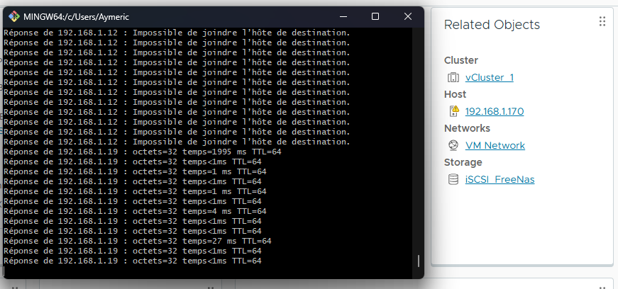
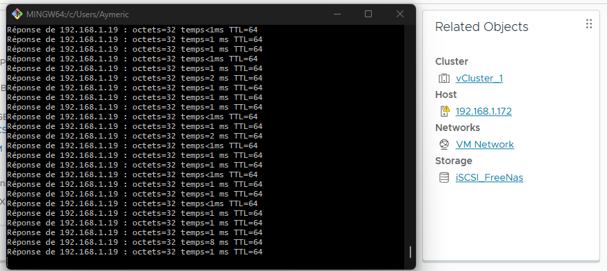

# 🛡️ HA (High Availability) – Haute Disponibilité avec vCenter

## 🧠 Définition

**HA (High Availability)** est une fonctionnalité avancée de **vCenter** permettant de **protéger les machines virtuelles (VM)** contre les pannes matérielles des hôtes **ESXi**.

## ⚙️ Objectifs de la fonctionnalité HA

- **Protection contre les pannes physiques** :
  - Si un **hôte ESXi** tombe en panne, les **VM hébergées** dessus sont automatiquement **redémarrées** sur les autres hôtes du cluster.
  
- **Surveillance des VM** :
  - Si **VM Monitoring** est activé et qu'une VM cesse d'envoyer des **heartbeats**, vCenter redémarre la VM automatiquement.

- **Surveillance des applications** :
  - HA peut surveiller le comportement d'une application et redémarrer la VM si l’application ne répond plus.

## 🔄 Fonctionnement

- HA fonctionne au sein d’un **cluster vCenter**.
- Un hôte fonctionne en **mode actif**, les autres restent **passifs** jusqu’à défaillance.
- En cas de panne, vCenter exécute un **failover automatique**, redémarre les VM et les **redistribue** sur les hôtes disponibles.

> 📝 Pour une haute disponibilité **sans redémarrage**, utilisez **Fault Tolerance (FT)**.

## ✅ Pré-requis pour activer vSphere HA

- Minimum **2 hôtes ESXi**
- Une **instance de vCenter**
- Un **cluster vCenter**
- Licences vSphere compatibles HA
- **Adresses IP statiques** sur tous les hôtes
- Configuration réseau identique sur les hôtes
- Réseau de HA sur un **subnet différent** du management
- **Stockage partagé** visible par tous les hôtes (NFS ou iSCSI)

## 🔧 Configuration de vSphere HA

> Tous les prérequis étant en place, je peux activer HA dans mon cluster.

1. Accès : `Cluster > Configurer > Disponibilité vSphere`
2. Cliquez sur **Modifier**
3. Activez :
   - ✅ **HA**
   - ✅ **Surveillance de l’hôte**
   - ✅ **Surveillance des VM** (permet le redémarrage automatique en cas de gel)

 

## 🧪 Test de vSphere HA

Pour valider la fonctionnalité, j’ai réalisé le test suivant :

1. J’ai lancé un **ping** en continu sur une **VM hébergée sur ESXi_1**
2. J’ai effectué un **shutdown** de ESXi_1 sans éteindre la VM (panne simulée)
3. Résultat :
   - La VM a été **automatiquement redémarrée** sur **ESXi_2**
   - Le **temps d’interruption** observé était de **30 secondes à 2 minutes**
   - La VM est revenue **sans intervention manuelle**

✅ **Test réussi** : la fonctionnalité **HA** est opérationnelle dans mon infrastructure.

