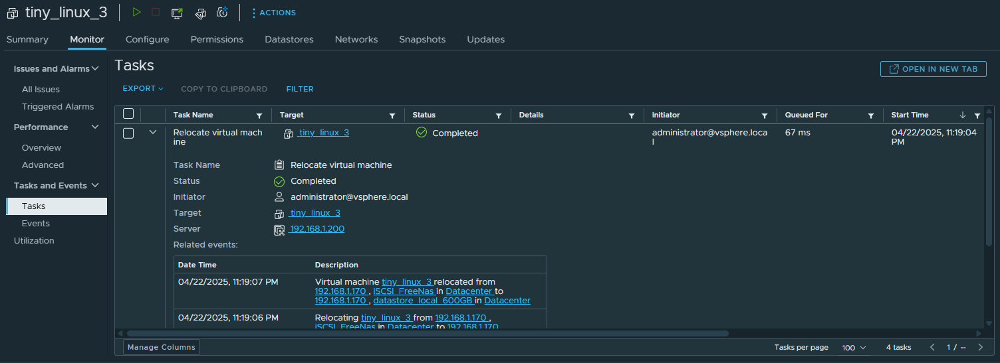
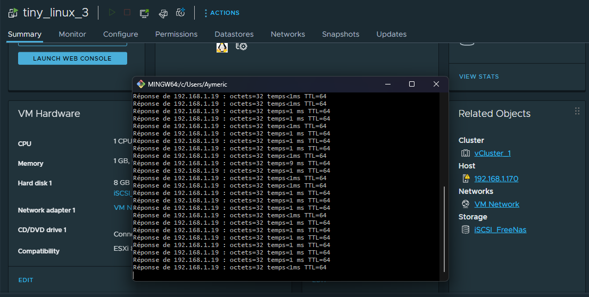
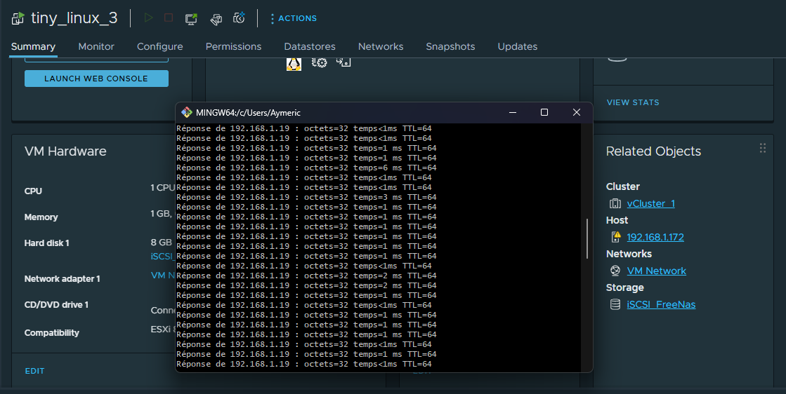
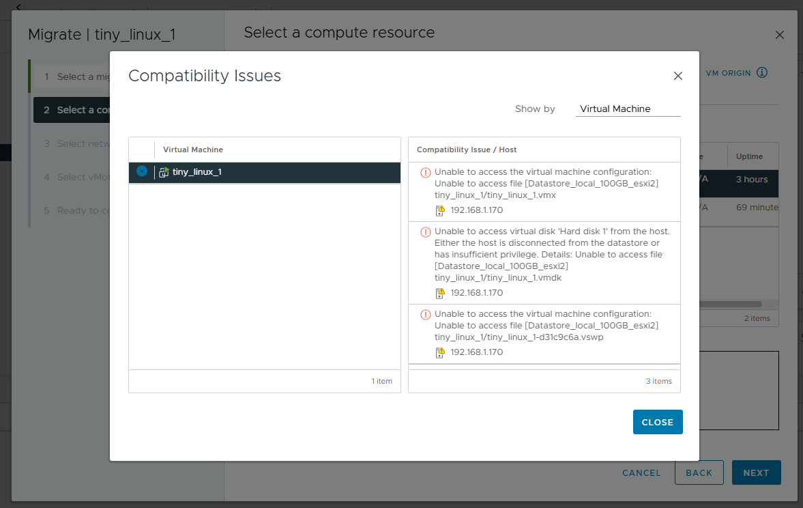

# 🔄 vMotion avec vSphere

## 🧠 Définition

**vMotion** est une fonctionnalité avancée de **vCenter** permettant de **migrer une machine virtuelle à chaud**, c’est-à-dire **sans interruption de service**, d’un hyperviseur **ESXi** à un autre.

## ⚙️ Ressources impliquées lors d’un vMotion

- **CPU** : Instructions de calcul
- **Mémoire vive** : Contenu en cours d’exécution
- **Réseau** : Connexion et paquets réseau
- **Stockage** : Le stockage reste inchangé si non spécifié, il doit être **partagé** entre les ESXi

## 🔁 Fonctionnement détaillé

### 🧬 Migration de la mémoire vive

- La VM utilise un fichier swap (`.vswp`) présent sur le **datastore partagé**
- L’hyperviseur de destination copie ce fichier swap dans sa propre mémoire vive

### 🧠 Migration du CPU

- Les nouvelles **instructions CPU** sont envoyées vers le nouvel hôte
- Les instructions restantes sont terminées sur l’hôte source avant la bascule

### 🌐 Migration du réseau

- Les paquets réseau sont redirigés dynamiquement vers l’hyperviseur de destination
- La connectivité est maintenue sans coupure visible

### ✅ Finalisation

- L’hyperviseur de destination **reprend totalement le contrôle** : exécution, accès disque, mémoire, réseau

## 🛠️ PRÉREQUIS vMotion

| Élément | Détail |
|--------|--------|
| 🖥️ Nombre d’hôtes | Minimum **2 hôtes ESXi** |
| ⚙️ CPU | Compatibilité matérielle (même **fabricant**, idéalement même génération) |
| 🧠 vCenter | 1 instance vCenter avec licence adéquate |
| 🌐 Réseau | Adresse IP **statique** sur tous les ESXi Réseaux identiques (mêmes VLAN, MTU, etc.) **VMkernel port** configuré pour vMotion |
| 📦 Stockage | **Datastore partagé** visible par tous les ESXi |
| 🔄 Compatibilité | Activation de l’option **EVC** (Enhanced vMotion Compatibility) dans le Cluster |

## 🧩 EVC (Enhanced vMotion Compatibility)

- Permet à vMotion de **standardiser les instructions CPU** sur une même génération, même si les hôtes ESXi ont des processeurs différents
- S’active au niveau du **Cluster vCenter**
- ⚠️ **Reboot nécessaire** des VM pour appliquer l’EVC

## 🧪 Étapes de migration avec vMotion

1. Aller dans :  
   `ESXi > Réseau > VMkernel adapters > vmk0 > Modifier`  
   ➕ Cocher : **vMotion**  
   ➰ Répéter sur tous les hôtes

2. Dans vCenter :  
   Clic droit sur la **VM à migrer** > **Migration**  
   🔸 Choisir : `Change compute resource only`  
   🔸 Sélectionner l’hôte de destination  
   🔸 Choisir le réseau virtuel > **Valider**

3. Vérifier dans l’onglet **Tâches** de la VM → Migration réussie ✅

## 🎯 Cas d’usage de vMotion

- 🔧 **Maintenance planifiée** d’un hôte sans impacter les utilisateurs
- 🔁 **Rééquilibrage de charge** dans un cluster vSphere
- 🔄 Automatisé avec **DRS** (Distributed Resource Scheduler)

> 💡 La migration est **transparente pour l’utilisateur final**, avec un temps de bascule **quasi instantané** si l’environnement est bien configuré.

 
 

# 🔄 Configuration de vMotion

## ⚙️ Préparation du réseau vMotion

Pour activer **vMotion**, il est nécessaire de configurer un adaptateur réseau **VMkernel** avec la fonctionnalité **vMotion activée** sur chacun des hôtes **ESXi**.

### Étapes :

1. Aller dans :  
   `ESXi_1 > Réseau > VMkernel adapters > vmk0 > Modifier`
2. Cocher l’option : ✅ **vMotion**
3. Répéter l’opération sur `ESXi_2`

> 🔁 **Important** : Un **stockage partagé** est **obligatoire** pour réaliser une **migration à chaud** (Live Migration).

## 🧪 Migration d'une VM avec vMotion

### Contexte :

Je vais migrer une **VM** de l’hôte **ESXi_1 (192.168.1.170)** vers **ESXi_2 (192.168.1.172)**.

### Étapes :

1. Clic droit sur la VM > **Migration**
2. Choisir l’option :  
   `Changer uniquement l’hôte (Change compute resource only)`
3. Sélectionner le nouvel hôte de destination (`ESXi_2`)
4. Choisir le **réseau virtuel** associé
5. **Valider** la migration

### 🔍 Vérification :

- La migration s’est effectuée sans interruption.
- Dans l’onglet **Tâches de la VM**, un message de **succès** confirme l’opération.

 

> ⚠️ Il est impératif d'avoir un stockage partagé entre les ESXi sans quoi un message d'erreur apparaitra lors de la migration. 

 

## ℹ️ Bon à savoir

### Les différents types de migration disponibles avec vMotion :

| Type de migration                 | Description                                                                 |
|----------------------------------|-----------------------------------------------------------------------------|
| **Compute only**                 | Migration des **ressources CPU, RAM et réseau** sans déplacer le stockage  |
| **Storage only (Storage vMotion)** | Déplacement du **stockage** uniquement, la VM reste sur le même hôte        |
| **Compute + Storage**            | Migration **complète** (ressources + fichiers VM) vers un autre hôte et stockage |

